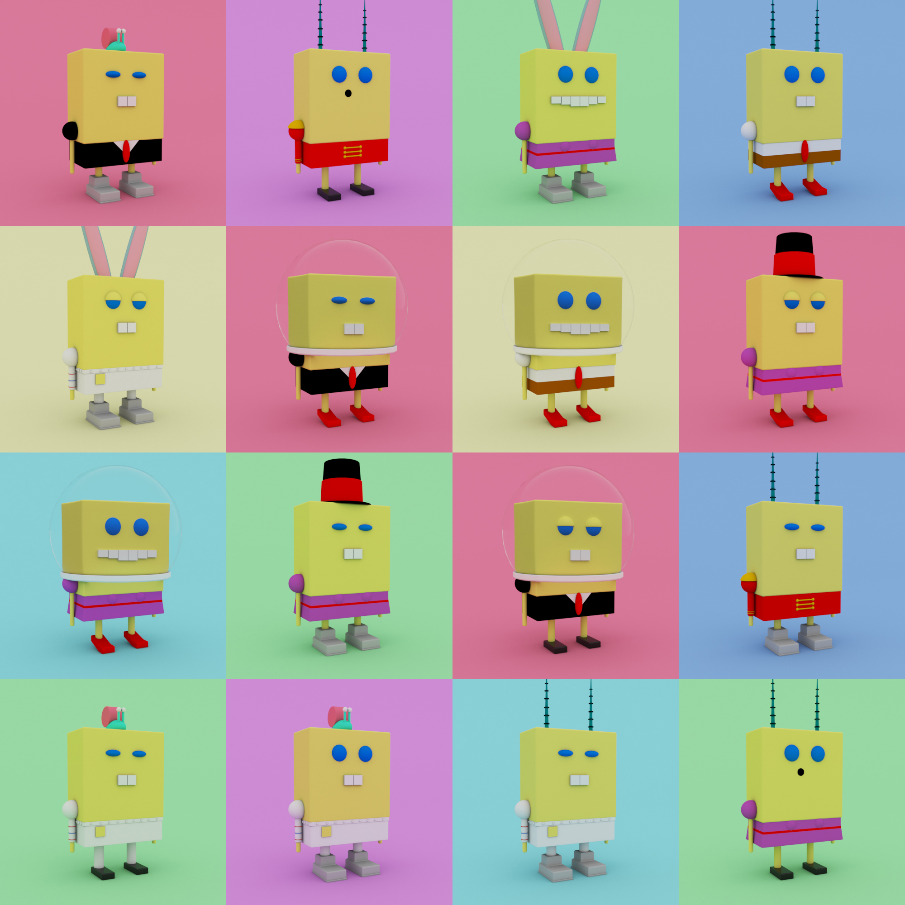
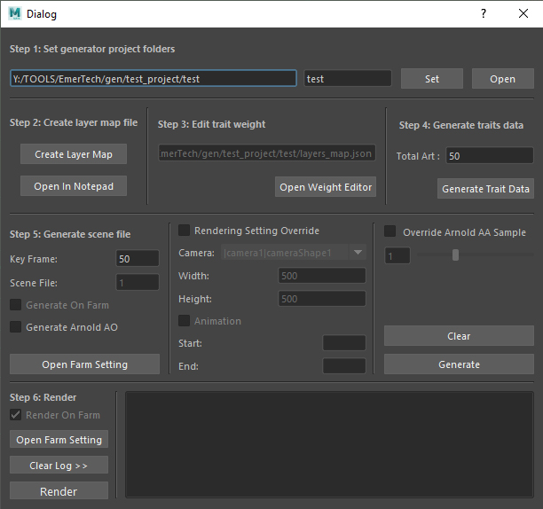
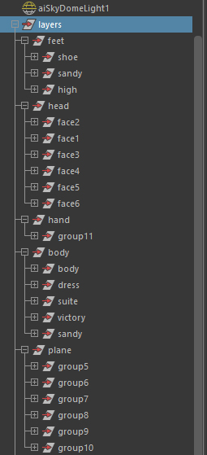

# 3D NFT Art Generator with Maya

Plugin for Maya that generates unique render from a collection of component trait based on weight.




### Dependencies

- Maya2018 and up
- Python 2.7


## Install
copy everything to C:\Users\user\Documents\maya\2018\scripts,

in maya script editor run following.
```python
import gen_main
import ui
import farm_ui
import farm_submission
ui.runMayaTemplateUi()
```

## Usage
- step1: set generate project folder\
As default, the generate project will set to locate in your maya project folder.\
By clicking the set button, it will create a scene folder and render folder inside of generate project folder\

- step2: create layer map\
layer map is the map that store all your traits data and the weights.\
Component assets structure in Outliner for layer map.\


- step3: edit your weight in layer map\
use step2 notepad for weight editing.\
example:\
```python
"cap": {
        "attributes": {
            "00_no_trait": {
                "trait_weight": 0
            },
            "astronaut": {
                "trait_weight": 1.0
            },
            "bunny": {
                "trait_weight": 1.0
            },
            "fedora": {
                "trait_weight": 1.0
            },
            "gary": {
                "trait_weight": 1.0
            },
            "horn": {
                "trait_weight": 1.0
            }
        }
    }
```
each trait weight is 1, total are 5, so each one has 20% chance.\
and 00_no_trait is 0, so it has 0% chance.\

- step4: generate traits data\
generating a list of trait data base on layer map.\
example:\
```python
    "0": {
        "body": "victory",
        "cap": "bunny",
        "feet": "shoe",
        "hand": "group11",
        "head": "face2",
        "plane": "group6"
    },
    "1": {
        "body": "dress",
        "cap": "fedora",
        "feet": "high",
        "hand": "group11",
        "head": "face2",
        "plane": "group10"
    },
```
this map will be use for to set up the key frames for final render.\

- step5: generate scene file\
using trait data to set up the key frames for final render.\
everything that was grey out is for animation render. don't have implement yet.\

- step6: render\
default using farm for rendering\
for local render please use batch render.\
